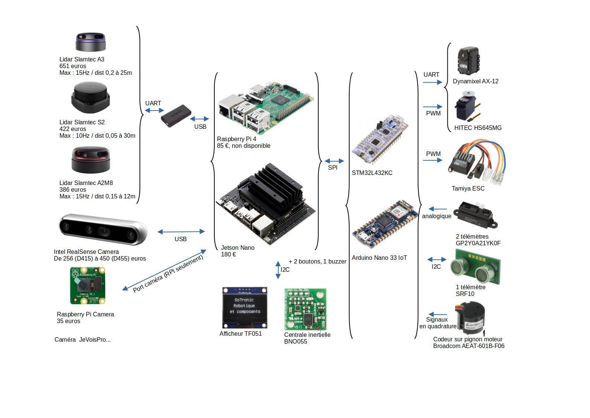

# Voiture type pour la course de voitures autonomes de Paris Saclay

Une voiture type est proposée pour la course de voitures autonomes. Le kit complet devrait être disponible à la vente à partir de novembre 2022, notamment pour des équipes sans moyens de fabrication mécanique et/ou électronique.
Cette voiture type n'est qu'un exemple pour aider les équipes à démarrer. Il ne demande qu'à être enrichi.

## Contrôle-commande

Le schéma synoptique de la partie contrôle-commande est le suivant, avec plusieurs possibilités de Lidars, caméras, nano-ordinateurs ou micro-contrôleurs : 

Une carte électronique de connexion de ces divers éléments est en cours de conception.

## La mécanique

Des pièces mécaniques dont les fichiers 3D seront fournis prochainement sur le git permettent d'adapter le châssis TT-02 à ces équipements de contrôle-commande. 

</img>

Outre les découpes propres de carrosserie, l'élément majeur de ce kit est l'ajout d'un codeur permettant d'obtenir une vitesse précise du moteur (éléments en rouge sur la figure ci-desssous)

</img>

Le kit propose notamment la possibilité d'utiliser un servo-moteur numérique AX-12 à la place du servo-moteur analogique standard.

</img>

Enfin, les pièces 3D permettent une fixation propre des capteurs à l'avant (caméra Raspberry) comme à l'arrière (télémètres IR et/ou ultrason).

</img>

## Liste du matériel

Voici une liste de matériel, de fournisseurs et de prix HT indicatifs.

* Tamiya TT-02 1:10 Toyota GR86 ref 58694 - Conrad 2451022 - 132 €
* Pièce de tuning Set levier de direction alu TT-02 ref 54574 - Conrad 1720254 - 40 €
* Chargeur de modélisme 220 V 1A  MW6168V NiMH VOLTCRAFT - Conrad 237739 - 15 €
* Pack de batterie (NiMh) 7.2 V 3000 mAh fiche T femelle - Conrad 238883 - 21 €
* Servomoteur numérique Dynamixel AX-12 - Gotronic 36433 - 41 €
* Centrale inertielle BNO055 Bosch - Gotronic 35784 - 22 €
* Afficheur OLED TF051 - Gotronic 36041			
* Scanner Laser 360° RPLIDAR A2M8	Slamtec	RPLIDAR A2M8 - Roboshop RB-Rpk-02 - 284 €
* Capteur de Distance GP2Y0A41SK0F IR Sharp - 4 à 30 cm - Roboshop RB-Dem-04 - 9 €
* Kit Raspberry Pi 4 Modèle B RPI4-MODB HDMISK-WHT4GB - Farnell 3401808 - 91 €
* Caméra pour Raspberry Pi, V2, Capteur Sony IMX219 8-Megapixel - Farnell 3677845 - 23 €
* STM32L011K4 MCU, Compatible Arduino Nano - Farnell 2535699 - 9 €
* Caméra avec profondeur RGBD Intel Realsense 82635AWGDVKPMP - DigiKey 544-3604-ND - 281 €
